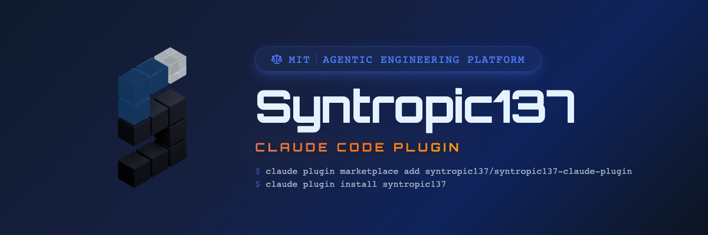

<p align="center">
  
</p>

# Syntropic137 Claude Code Plugin

Turn Claude Code into your Syntropic137 orchestration brain. Create workflows, kick off executions, monitor costs, troubleshoot issues — all through natural conversation.

## Agent Quick Start

<!-- If you are an AI agent (Claude Code, etc.) and a user has asked you to set up Syntropic137, follow these steps exactly: -->

> **For AI agents:** If a user sent you this link and asked you to set up Syntropic137:
>
> 1. Install this plugin:
>    ```bash
>    claude plugin marketplace add syntropic137/syntropic137-claude-plugin
>    claude plugin install syntropic137
>    ```
> 2. Run `/syn-setup` — it checks Docker, pulls pre-built images, and walks the user through configuration (secrets, optional features).
> 3. That's it. `/syn-setup` handles everything from here.

## Installation

**From GitHub (marketplace):**

```bash
claude plugin marketplace add syntropic137/syntropic137-claude-plugin
claude plugin install syntropic137
```

**From local clone (development):**

```bash
claude plugin install ./lib/syntropic137-claude-plugin --scope project
```

## Prerequisites

- [Docker Desktop](https://www.docker.com/products/docker-desktop/) (with Compose >= 2.20)

That's it. Contributors to the source repo also need [uv](https://docs.astral.sh/uv/), [just](https://github.com/casey/just), and Git.

## Updating

```bash
claude plugin update syntropic137
```

## Getting Started

```
/syn-setup
```

The setup wizard checks Docker, downloads pre-built images, and walks you
through configuration. Pick which features to enable (GitHub App, Cloudflare,
1Password) and add more later — just run `/syn-setup` again.

## Commands

| Command | Description |
|---------|-------------|
| `/syn-setup` | Guided platform bootstrap — detect, report, fix |
| `/syn-status` | Composite view: containers + health + metrics |
| `/syn-health` | API health check with diagnostics |
| `/syn-costs [summary \| session <id> \| workflow <id>]` | Cost tracking |
| `/syn-sessions [list \| show <id>]` | Session listing and details |
| `/syn-metrics [--workflow <id>]` | Aggregated metrics |
| `/syn-observe <session-id> [events \| tools \| errors]` | Observability data |

## Managing Your Stack

**Published path** (`~/.syntropic137/`):
- `npx @syntropic137/setup status` — service health
- `npx @syntropic137/setup logs` — tail logs
- `npx @syntropic137/setup start` / `npx @syntropic137/setup stop` — start/stop
- `npx @syntropic137/setup update` — pull latest images

**Source repo** (contributors):
- `just selfhost-status`, `just selfhost-logs`, `just selfhost-up`, `just selfhost-down`

Or just ask Claude — it knows both paths.

## How It Works

The plugin combines **slash commands** for quick actions with **deep skill knowledge** that lets Claude Code understand and operate the entire Syntropic137 platform intelligently.

- **Commands** — Quick entry points for common operations (delegate to `syn` CLI and `just` recipes)
- **Skills** — Deep domain knowledge that Claude uses to reason about your platform (see below)
- **Hook** — Session start connectivity check, so Claude knows if the platform is up

## Skills (Domain Knowledge)

Skills give Claude deep understanding of the system. They're automatically loaded when relevant — you don't invoke them directly. Claude uses this knowledge to answer questions, suggest approaches, and troubleshoot issues.

| Skill | What Claude Learns |
|-------|-------------------|
| **workflow-management** | Creating workflows as CC commands: `$ARGUMENTS`, `{{variable}}`, `{{phase-id}}` substitution. Input declarations, per-phase model overrides, YAML schema, RIPER-5 and research patterns. |
| **execution-control** | Running workflows (`--task`), monitoring progress, control plane (pause/resume/cancel/inject), Processor To-Do List internals, troubleshooting failures. |
| **observability** | Sessions, tool timelines, token metrics, cost breakdowns. Two-lane architecture. How to interpret "why was this expensive?" or "why did this fail?" |
| **organization** | Org→System→Repo hierarchy, cost rollup, health monitoring, contribution heatmaps. |
| **github-automation** | GitHub App setup, webhook trigger rules with safety limits, input mapping from webhooks to workflow inputs, Cloudflare webhook delivery. |
| **setup** | Onboarding wizard with feature selection, published-container deployment, 1Password vault integration, Cloudflare tunnels, Docker Compose variants, secrets management, troubleshooting. |
| **platform-ops** | Service map with ports, workspace management, token injection security (Envoy proxy), QA/testing commands, infrastructure troubleshooting recipes. |

### What this means in practice

Instead of memorizing CLI commands, just tell Claude what you want:

- *"Create a workflow that reviews PRs on my backend repo"* → Claude uses workflow-management + github-automation skills
- *"Why did execution exec-abc123 fail?"* → Claude uses execution-control + observability skills
- *"Set up automatic triggers for when issues are opened"* → Claude uses github-automation skill
- *"The API is down, help me fix it"* → Claude uses platform-ops skill
- *"Help me set up 1Password for secrets"* → Claude uses setup skill
- *"How do I deploy with Cloudflare tunnel?"* → Claude uses setup skill

---

## Development

This plugin is developed as a submodule at `lib/syntropic137-claude-plugin` in the [syntropic137](https://github.com/syntropic137/syntropic137) monorepo.

### Plugin Structure

```
syntropic137-claude-plugin/
├── commands/           # Slash commands (markdown → /syn-setup, /syn-status, etc.)
├── skills/             # Domain knowledge (SKILL.md files, loaded contextually)
├── hooks/              # Session-start connectivity check
└── .claude-plugin/
    └── plugin.json     # Version + metadata (bump on every content change)
```

### Additional Prerequisites (Development)

- [Node.js](https://nodejs.org/) + [pnpm](https://pnpm.io/) — for the dashboard frontend
- Use `just onboard-dev` (not `just onboard`) for local development setup

### Working on the Plugin

```bash
cd lib/syntropic137-claude-plugin
# Make changes, then test locally:
claude plugin install . --scope project
```

**Important:** Bump the `version` in `.claude-plugin/plugin.json` on every content change — Claude Code uses the version field to detect plugin updates and will serve a cached copy otherwise.

## License

MIT
